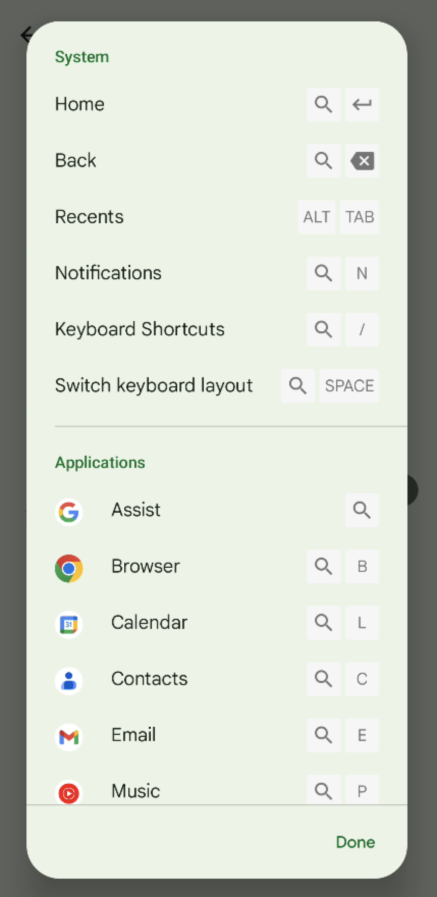
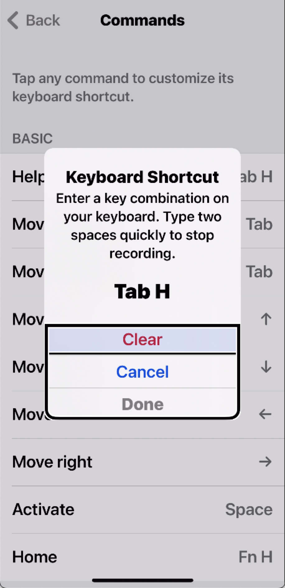

# Keyboard Accessibility testing on mobile devices

# Setup
## Which keyboard should you get?
Any bluetooth keyboard should work. If you are testing both iOS and Android, it is worth having a dedicated keyboard for each. If you are working alone and would like to save money, you can use one keyboard for two devices. It is more convenient if you get a multi-device keyboard because they allow switching between multiple paired devices instead of having to constantly unpair and pair. Another way to use one keyboard with multiple devices is with Apple’s Magic Keyboard which can be connected using bluetooth to an iPhone and using USB-C to a Google Pixel.

## Setting up a bluetooth keyboard on iOS
1. Pair your keyboard with your iPhone by going to `Settings > Bluetooth` and setting Bluetooth `On`.
2. Choose your bluetooth keyboard.
3. Before using your keyboard, enable <abbr title="Full Keyboard Access">FKA</abbr> (Full Keyboard Access) by going to `Accessibility > Keyboards > Full Keyboard Access`.

### Setting up a bluetooth keyboard on Android
1. Pair your keyboard with your Android device by going to `Settings > Connected Devices > Pair new device`. 
2. Upon connection, you get a prompt confirming the keyboard type.

## Discovering the keystrokes
### Android’s keyboard shortcuts
After connecting the keyboard, go to `Settings > System > Languages & Input > Physical Keyboard > Keyboard Shortcuts`.
This will display a list of keyboard shortcuts.

The shortcut list uses a search icon which may be present on some keyboards such as the Logitech K480 and the Logitech K780. On other keyboards, such as Apple’s Magic Keyboard, this corresponds to the command key. 

The list of shortcuts shown does not show how to perform some critical actions like navigating between the top bar and the main content and the keystrokes cannot be re-mapped.Refer to our keystrokes table for a full list.

### iOS Full Keyboard Access Commands
Go to `Settings > Accessibility > Keyboards > Full Keyboard Access > Commands`.

This gives a full list of the commands and allows re-mapping and recording keyboard shortcuts.

## Keystrokes for testing on Android

|                                                                    Action                                                                    |     Magic keyboard    |      Logitech K480       | [keyboard model] |
|----------------------------------------------------------------------------------------------------------------------------------------------|-----------------------|--------------------------|------------------|
| Navigate to the next interactive element                                                                                                     | `Tab`                 | `tab`                    |                  |
| Navigate to the previous interactive element                                                                                                 | `shift + tab`         | `shift + tab`            |                  |
| Scroll/Go to next item in group   Select items in a collection, list, or menu                                                           | `arrow keys`          | `arrow keys`             |                  |
| Activate an interactive element                                                                                                              | `enter` or `space bar` | `enter` or `space bar`    |                  |
| Go Back. This can be used to dismiss menus and popups.                                                                                       | `command + backspace` | `search-icon key + back` |                  |
| Exit                                                                                                                                         | `Esc`                 | `esc`                    |                  |
| Switch between apps                                                                                                                          | `option + tab`        | `alt + tab`              |                  |
| Switch between panes such as top navigation pane and main content [^1]                                                                       | `command + tab`       | `start + tab`  |                  |
| Open keyboard shortcuts list.   - The shortcuts for Home, Back and Notifications use the search-icon key which is just the command key. | `command + /`         | `start + /`    |                  |

[^1]: On Android 14, switching between panes is done with control + tab

## Keystrokes for testing on iOS

|                                       Action                                       |    Magic keyboard   | Logitech K480 | [keyboard model] |
|------------------------------------------------------------------------------------|---------------------|---------------|------------------|
| Navigate to the next interactive element                                           | `tab`               |               |                  |
| Navigate to the previous interactive element                                       | `shift + tab`         |               |                  |
| Scroll/Go to next item in group   Select items in a collection, list, or menu | `arrow keys`        |               |                  |
| Activate an interactive element                                                    | `space bar`         |               |                  |
| Show Help                                                                          | `tab + h`           |               |                  |
| Go Back. This can be used to dismiss menus and popups.                             | `tab +  b`          |               |                  |
| Exit                                                                               | `esc`               |               |                  |
| Show Custom Accessibility Actions                                                  | `tab + z`           |               |                  |
| Switch between apps                                                                | `function + up arrow` |               |                  |

# Testing
## Overview of keyboard testing procedure
|                                             Test Steps                                             |                                WCAG SC                                 |
|----------------------------------------------------------------------------------------------------|------------------------------------------------------------------------|
| Ensure all actions can be performed by keyboard.                                                   | [2.1.1 Keyboard](https://www.w3.org/WAI/WCAG21/Understanding/keyboard) |
| Ensure there are no keyboard traps                                                                 | [2.1.2 No Keyboard Trap](https://www.w3.org/WAI/WCAG21/Understanding/no-keyboard-trap) |
| Ensure the focus order is logical.                                                                 | [2.4.3 Focus Order](https://www.w3.org/WAI/WCAG21/Understanding/focus-order) |
| Ensure keyboard focus is visible                                                                   | [2.4.7 Focus Visible](https://www.w3.org/WAI/WCAG21/Understanding/focus-visible) |
| When any user interface component receives focus, ensure it does not initiate a change of context. | [3.2.1 On Focus](https://www.w3.org/WAI/WCAG21/Understanding/on-focus) |
| Ensure character key shortcuts without modifiers can be remapped or turned off                     | [2.1.4 Character Key Shortcuts](https://www.w3.org/WAI/WCAG21/Understanding/character-key-shortcuts) |
| Ensure content which appears on focus, is persistent and dismissable.                              | [1.4.13 Content on Hover or Focus](https://www.w3.org/WAI/WCAG21/Understanding/content-on-hover-or-focus) |
|                                                                                                    |                                                                        |

## Full keyboard testing procedure

<ol start="1" type="1">
	<li>Ensure all actions can be performed by keyboard.
		<ol start="1" type="a">
			<li><strong>iOS:</strong>
				<ol start="1" type="i">
					<li>If an action is not available, check if there are custom actions. Also try <code>tab + g</code> to perform keyboard gestures. Depending on interpretation, keyboard gestures may not be a viable alternative for meeting 2.1.1.</li>
				</ol>
			</li>
			<li><strong>Android:</strong>
				<ol start="1" type="i">
					<li>If an action is not available. Open the  keyboard shortcuts list to check for any alternative methods to perform an action.</li>
					<li>If you cannot access the top navigation pane or other segment of the screen, check if you can reach the area by using the “switch between panes” keystroke.</li>
				</ol>
			</li>
		</ol>
	</li>
	<li>Ensure there are no keyboard traps.
		<ol start="1" type="i">
			<li>If an element receives keyboard focus, it should be possible to move focus away using standard inputs or there are instructions to guide users.</li>
		</ol>
	</li>
	<li>Ensure the focus order is logical.
		<ol start="1" type="a">
			<li>When navigation sequences affect meaning and operability, focusable components need to receive focus in an order that preserves meaning and operability.</li>
			<li>The focus order should generally follow the top to bottom start to end reading order but it may divert from this if the order.</li>
			<li>When a modal appears focus should be set in the modal and when dismissed, focus should be returned to the triggering element.</li>
		</ol>
	 </li>
	<li>Ensure keyboard focus is visible.
		<ol start="1" type="a">
			<li>Users should always be able to tell which element has keyboard focus.</li>
			<li><strong>iOS:</strong>
			<ol start="1" type="i">
				<li>The default <abbr title="Full Keyboard Access">FKA</abbr> indicator is enough and it can be customized in the Full Keyboard Access settings. </li>
			</ol>
			</li>
			<li><strong>Android:</strong>
				<ol start="1" type="i">
					<li>The default focus indicator tends to be very faint. In cases where the developer has not modified the default Android styles (unlikely), then the default indicator is sufficient.</li>
				</ol>
			</li>
		</ol>
	</li>
	<li>When any user interface component receives focus, ensure it does not initiate a change of context. <strong>Note:</strong> this is unlikely to occur on native mobile apps.
		<ol start="1" type="a">
			<li>Ensure elements receive focus do not cause any of the following:
				<ol start="1" type="i">
					<li>Forms submitted automatically;</li>
					<li>New windows launched;</li>
					<li>Focus is changed to another component when that component receives focus;</li>
					<li>Switching to a different app or user agent</li>
					<li>Changes to content that affect the meaning of the screen/page.</li>
				</ol>
			</li>
		</ol>
	</li>
	<li>Ensure character key shortcuts without modifiers can be remapped or turned off.
		<ol start="1" type="a">
			<li>Try inputting all of the alphabet, punctuation, number and symbol characters. If any of these keys are used alone then make sure one of the following is true:
				<ol start="1" type="i">
					<li>There is a mechanism available to turn the shortcut off;</li>
					<li>A mechanism is available to remap the shortcut to include one or more non-printable keyboard keys (e.g., <code>Ctrl, Alt/Option</code>)</li>
					<li>The keyboard shortcut for a user interface component is only active when that component has focus.</li>
				</ol>
			</li>
		</ol>
	</li>
	<li>Ensure content which appears in focus, is persistent and dismissable. <strong>Note:</strong> this is unlikely to occur on native mobile apps.
		<ol start="1" type="a">
			<li>Where receiving and then keyboard focus triggers additional content to become visible and then hidden, the following are true:
				<ol start="1" type="i">
					<li>Dismissible: A mechanism is available to dismiss the additional content without moving keyboard focus, unless the additional content communicates an input error or does not obscure or replace other content;</li>
					<li>Persistent: The additional content remains visible until the focus trigger is removed, the user dismisses it, or its information is no longer valid.</li>
					<li>(Hoverable is not applicable to mobile because it is only for mouse hover.)</li>
				</ol>
			</li>
		</ol>
	</li>
</ol>

## References
### Apple iPhone
* [	Adjust the onscreen and external keyboard settings on iPhone - Apple Support](https://support.apple.com/guide/iphone/adjust-keyboard-settings-ipha7c3927eb/ios)
* [Use shortcuts on Magic Keyboard with iPhone](https://support.apple.com/guide/iphone/use-shortcuts-iph3da414515/17.0/ios/17.0)
* [Pair Magic Keyboard with iPhone](https://support.apple.com/guide/iphone/pair-magic-keyboard-iph4288319c0/17.0/ios/17.0)

